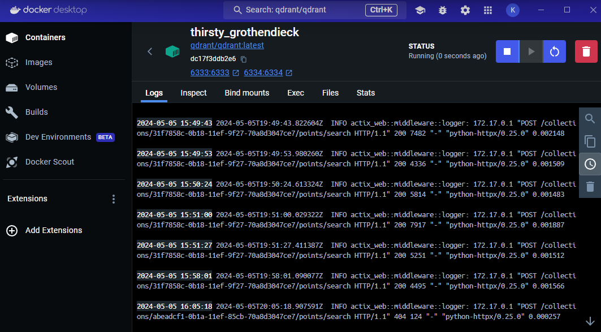
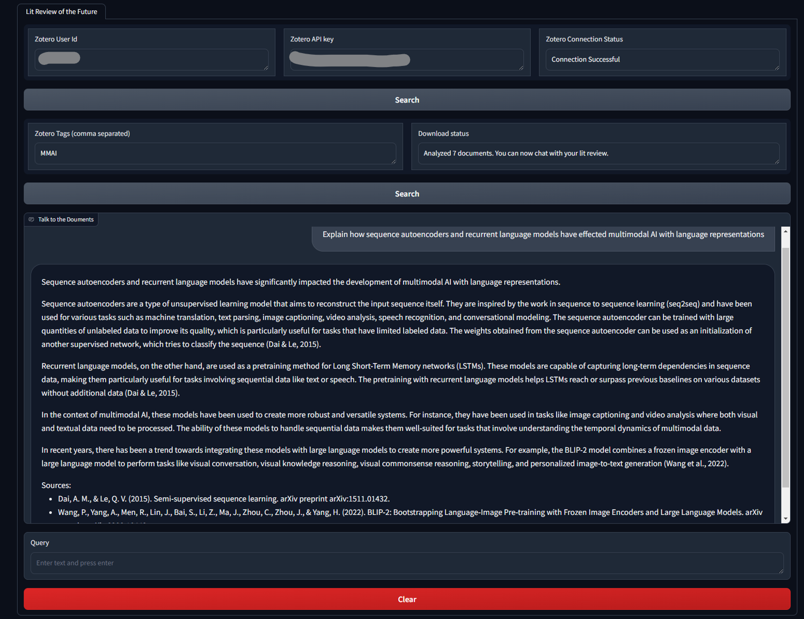

# Quickstart

pip install -r requirements.txt

If torch doesn't install with cuda then pip uninstall torch torchvision, then: pip3 install torch torchvision torchaudio --index-url https://download.pytorch.org/whl/cu121

To run you must connect to a local quadrant instance. You can use docker to launch the qdrant/qdrant:latest image with port 6663 and 6664 exposed.

Once the database is running the application can be run by terminal: uvicorn run:app --reload

The app will be running at: http://127.0.0.1:8000/gradio/

# Usage

To use the app, input a tag from your Zotero Library and click search to generate the knowledge source. Once the download status says you can chat, you are free to use the chat to talk to the literature review.

Basic RAG works best when you are very specific about what you wish to learn from the texts so that your prompt can be interpreted into an embedding that will have a high similarity score to the parts of the text that have the best answers. That means that prompts like "summarize the documents." or "explain this topic." are much weaker RAG prompts than something specific like "What pretraining methods does the CLIP model use that other multimodal AI models do not use?". These specifics help in search out the specifics in the documents for retrieval.

By embedding the text with metadata connecting it to its sources, the RAG model is able to get real information (as opposed to purely generative AI) and cite its sources directly.

Credits:
[RajKKapadia](https://github.com/RajKKapadia/YouTube-Talk-to-Papers-RAG) for starter code